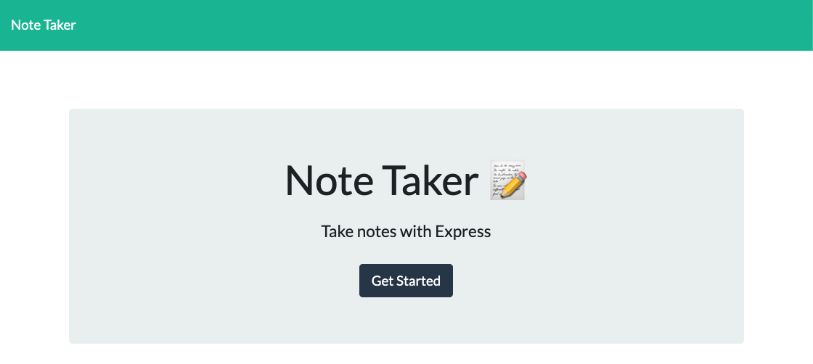
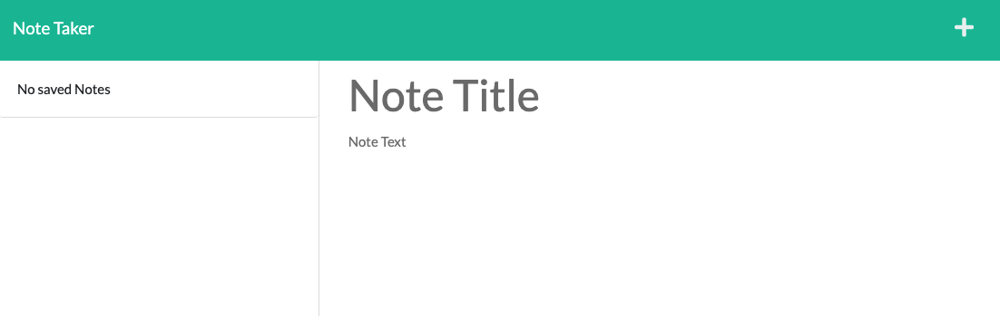
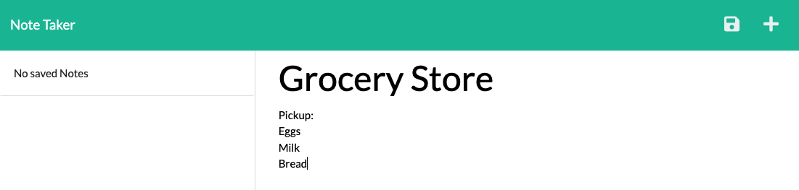
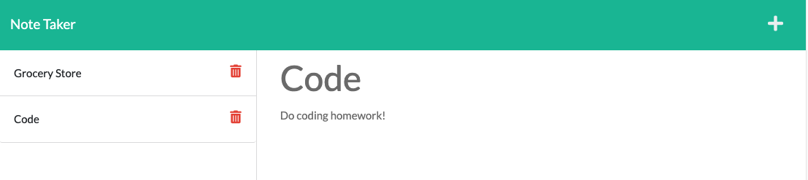

# Note Taker

## Description

A note-taking application that allows the user to enter a note Title and Text and save the note to a list of notes on the left side of the page. Each saved note is appended with a funtional delete button as well.

Click "Get Started" to open Notes page

Enter first note

Any existing note on the left can be clicked to display a read-only version of the note Title asnd Text.

Data is stored in db.json file either on the local server (if repo is cloned to local machine) or Heroku server.

[Click here to use app deployed from Heroku](https://lit-river-55101.herokuapp.com/)
